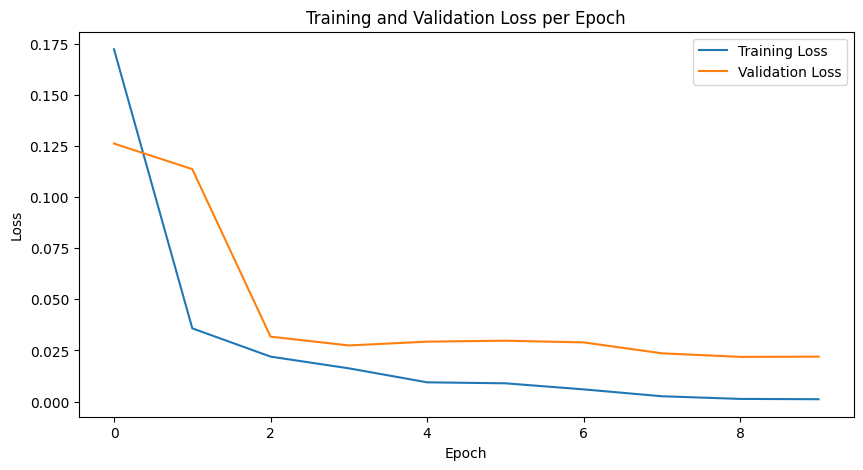

# ResNet-Implementation

This repo trains a ResNet18 model on the MNIST dataset. The dataset is resized and normalized to fit the ResNet model, and training is done using PyTorch.

#### ResNet Architecture


## Project Steps

### 1. Import Required Libraries
To set up the environment, use the following commands:

```bash
conda create --name pytorch_env python=3.11.9 --file requirements.txt
conda activate pytorch_env
```

### 2. Load the MNIST Dataset
- Dataset is loaded using `torchvision.datasets.MNIST`.
- Images are resized to 224x224, normalized, and converted to tensors.

### 3. Split the Dataset
The combined training and test dataset is split into:
- **Training Set**: 42,000 samples
- **Validation Set**: 14,000 samples
- **Test Set**: 14,000 samples

### 4. Load Pre-trained ResNet
- ResNet18 is loaded and modified for single-channel input and 10 output classes.
- Assign data to respective dataloaders.

### 5. Define Loss Function and Optimizer
- **Loss Function**: CrossEntropyLoss
- **Optimizer**: SDG with learning rate 0.01

## Results

- **Test Accuracy**: The accuracy achieved on the test set is **99.56%** </br></br>



## References

- [Geeksforgeeks](https://www.geeksforgeeks.org/resnet18-from-scratch-using-pytorch/)
- [Resnet - PyTorch](https://pytorch.org/hub/pytorch_vision_resnet/)
